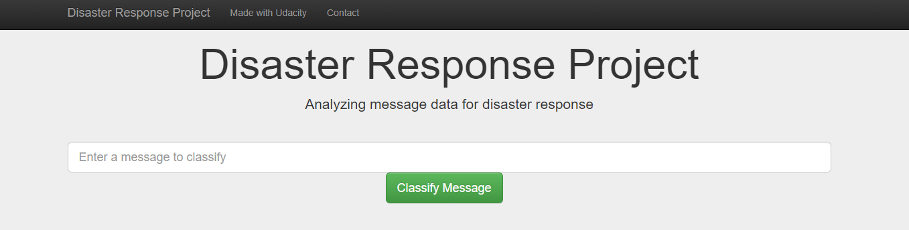
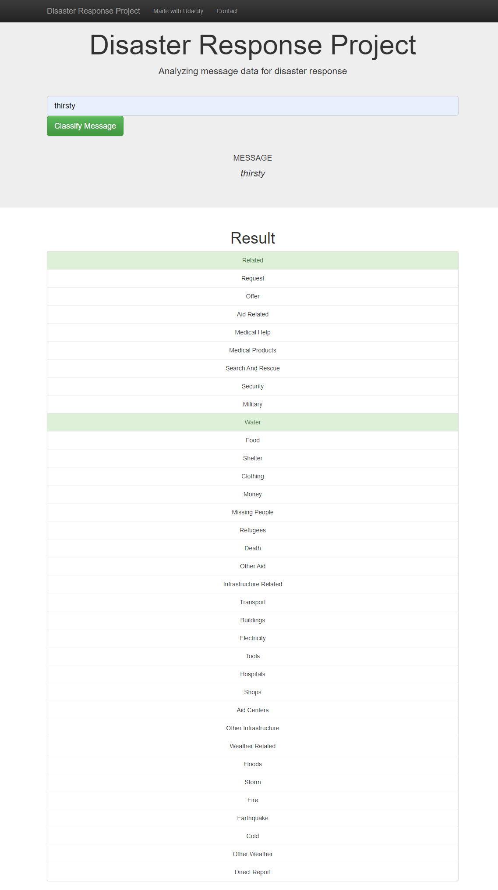

# Disaster Response Pipeline

## Table of Contents
1. [Project Description](#description)
2. [Getting Started](#getting_started)
	1. [Libraries](#Libraries)
	2. [Executing Program](#execution)
	3. [Additional Material](#material)
3. [License](#license)
4. [Acknowledgement](#acknowledgement)

## Project Description
The project is to analyze disaster data from [Figure Eight](https://www.figure-eight.com/) to build a model for an API that classify disaster message on a real time basis. After searching key messages in the search box, the categoriries of the event will be sent to an appropriate disaster relief agency. 

This project is divided in the following key steps: 

### 1. ETL pipeline
Load the raw csv-file provided, extract the messages and categories as a dataframe, clean the data and load it into an SQLite database.
### 2. Machine Learning pipeline
Build a machine learning pipeline using NLTK, as well as scikit-learn's pipeline and GridSearchCV, export the model to a pickle file.
### 3. Flask App
Run a web app, display results in a flash web app, creat data visualizations.

## Getting Started

### Libraries 
- re
- Pandas
- SQLAlchemy
- Pickle
- NLTK
- SKLearn
- Flask
- Plotly

### Executing Program:
1. You can run the following commands in the project's directory to set up the database, train model and save the model.

    - To run ETL pipeline to clean data and store the processed data in the database
        `python data/process_data.py data/disaster_messages.csv data/disaster_categories.csv data/disaster_response_db.db`
    - To run the ML pipeline that loads data from DB, trains classifier and saves the classifier as a pickle file
        `python models/train_classifier.py data/disaster_response_db.db models/classifier.pkl`

2. Run the following command in the app's directory to run your web app.
    `python run.py`

3. Open another Terminal Windows and type:
     `env|grep WORK`
4. In a new web browser window, type in the following:
     http://SPACEID-3001.SPACEDOMAIN
  The number 3001 represents the port where your web app will show up. Make sure that the 3001 is part of the web address you type in.
  
 ### Additional Material
 
 The following is the screenshot of an example of the search result:

 
 ## Acknowledgements

* [Udacity](https://www.udacity.com/) for providing an amazing Data Science Nanodegree Program
* [Figure Eight](https://www.figure-eight.com/) for providing the relevant dataset to train the model
 

